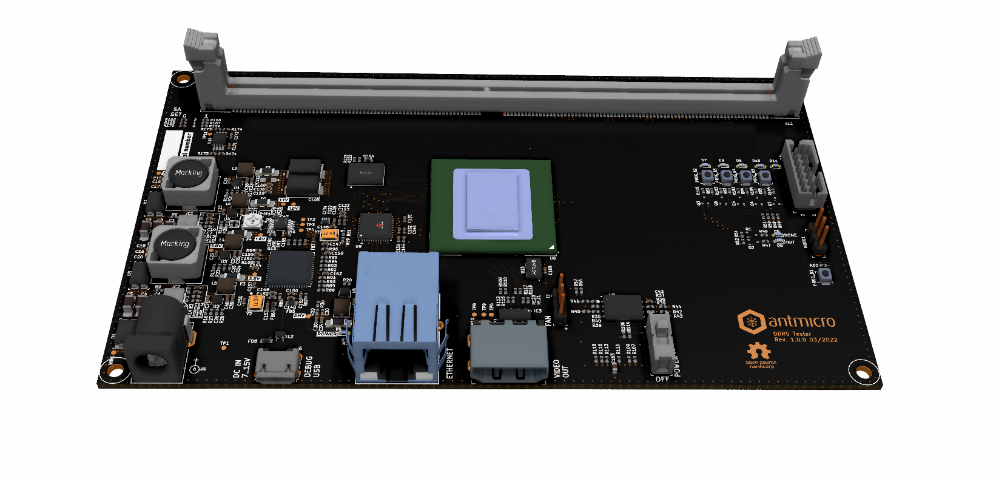

=======================
Data Center DDR5 Tester
=======================

Copyright (c) 2021 `Antmicro <https://www.antmicro.com>`_

Overview
--------

This repository contains open hardware design files for an experimental platform built around Xilinx Kintex-7 FPGA.
The main purpose of this platform is to develop and customize RAM controllers supporting DIMM DDR5 RAM modules used in data centers.
The design files were prepared in KiCad.

Repository structure
--------------------
The main repository directory contains KiCad PCB project files, a LICENSE and README.
The remaining files are stored in the following directories:

* ``lib`` - contains the component libraries
* ``img`` - contains graphics for this README

Key Features
------------

* Kintex-7 FPGA - XC7K100T-FBG686
* DDR5 DIMM connector
* HDMI output connector
* Ethernet RJ45 connector with 1GbE transciever
* Micro USB debug connector with FT4232HQ FTDI USB controller
* JTAG
* microSD card slot
* 16Mbytes S25FL128S QSPI FLASH memory
* S27KL0641 HyperRAM
* External 7-12V power input
* 5 user LEDs
* 4 user buttons

License
=======

`Apache-2.0 <LICENSE>`_
